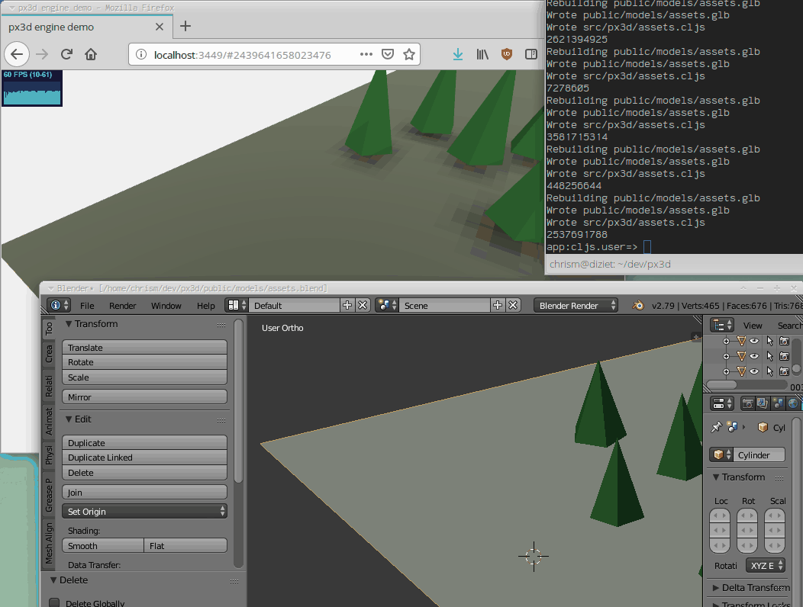

Hot reloading Blender edits into running Three.js ClojureScript:



### Development mode
To start the Figwheel compiler, navigate to the project folder and run the following command in the terminal:

```
lein figwheel
```

Figwheel will automatically push cljs changes to the browser.
Once Figwheel starts up, you should be able to open the `public/index.html` page in the browser.

### REPL

The project is setup to start nREPL on port `7002` once Figwheel starts.
Once you connect to the nREPL, run `(cljs)` to switch to the ClojureScript REPL.

### Building for production

```
lein clean
lein package
```
